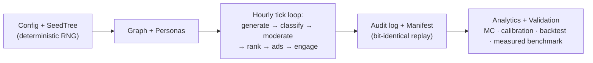

# SocioSim

A research-grade social-interaction simulator: synthetic social networks, content
generation, feed ranking, policy-as-code moderation (US §230 / EU DSA / CN
AI-labelling / FTC endorsement packs), advertising with holdout measurement,
append-only audit logs with deterministic replay, and uncertainty-quantified
analytics.

> ## ⚠️ Research use only
>
> SocioSim produces **counterfactual projections under stated assumptions**, not
> predictions of real-world behaviour. Headline rates/effects carry confidence
> intervals and provenance; descriptive diagnostics are point/count summaries.
> Interpret every result as a stress test, never as truth.
>
> **Prohibited uses:** targeting or ranking real individuals; predicting real
> protests or events; generating enforcement decisions; optimising real-world
> manipulation. Personas are synthetic; no real-person data is ingested at the
> individual level; no personally identifiable information and no model
> chain-of-thought is ever stored.

## What this is (and isn't) useful for

Honest scope — what SocioSim genuinely supports, and what it does not:

**Useful for**
- **Trust-&-safety / policy research & education:** a transparent, deterministic
  sandbox to explore how moderation policy (EU DSA, US §230, CN AI-labelling, FTC),
  feed ranking, and advertising interact — headline outputs carry uncertainty
  intervals and provenance labels.
- **Counterfactual scenario stress-testing:** compare regulatory regimes or
  marketing strategies as "what-if" worlds (A/B compare with common random
  numbers), with Monte-Carlo uncertainty — for analysts in government or business.
- **A working reference for measurement methodology:** auditable implementations
  of ad **incrementality** (RCT holdout + Newcombe CI + CUPED + BH-FDR + MDE),
  **calibration** (history-matching / ABC, consistency against published aggregates),
  **sensitivity** (Saltelli S1+total-effect), and a **moderation classifier
  measured on real licensed benchmarks** (F1/ROC-AUC/Brier/log-loss).
- **Marketing planning at jurisdiction / international scale:** the Marketing suite
  (A/B power, unit economics, reach/frequency, GARM brand-safety) operates *within*
  the active jurisdiction packs (a single regime, or all three for an international
  view).

**NOT useful / out of scope (by design + law)**
- Not a predictor of any real platform, person, or event — agent behaviour is a
  *calibrated assumption*, not measured truth (only the classifier component is
  measured on real data). Outputs are projections, not forecasts.
- Not for targeting/ranking real individuals, enforcement decisions, or
  surveillance. No real-person data/PII; research use only.

Every claim is bounded by its provenance label (`docs/MODELS.md` §5–6); nothing
here is asserted beyond what the code measures.

## Architecture at a glance



Full model definitions, per-tick data flow, and the validation ladder (with
diagrams) are in **[docs/MODELS.md](docs/MODELS.md)**.

## Install

SocioSim needs four runtime packages (numpy, networkx, scipy, pyyaml). Install
them before running anything — `python run.py` will otherwise print a clear
"missing dependency" message telling you to do this.

```bash
python -m venv .venv                       # recommended: isolate from system Python
.venv\Scripts\activate                     # Windows  (source .venv/bin/activate on macOS/Linux)
pip install -e .                           # SocioSim + runtime deps
# or, without installing the package:  pip install -r requirements.txt
# add tooling for tests/lint:           pip install -e .[dev]
```

> If you see `ModuleNotFoundError: No module named 'networkx'`, the deps aren't
> installed in the Python you're using. Activate the venv (above) and re-run
> `pip install -e .`. On Windows, the Microsoft-Store `python` shim has no
> packages — use the venv's interpreter.

## Quick start (one command)

```bash
python run.py --web      # browser dashboard (recommended) — opens automatically
python run.py            # CLI run, template mode — no LLM needed (deps must be installed)
python run.py --llm      # CLI run with a free local LLM (auto Ollama)
```

### Start the app with *everything* included

The **web console is the all-in-one entry point** for configuration and analysis
controls (trained classifier, calibrated graph, named benchmarks, dynamic graph,
Monte Carlo). CLI-only media export remains available through `--media`:

```bash
pip install -e .          # one-time: install deps (skip if already done)
python run.py --web --llm # launches the studio + a free local LLM; pick options in the UI
```

Prefer one CLI run that turns **everything** on at once:

```bash
python run.py --llm --profile calibrated --classifier trained \
              --benchmark twitter_like --dynamic-graph --replicates 20 --media 5
```

That runs: local-LLM content · history-matched calibrated graph · real trained
moderation classifier · Twitter-like benchmark · follow/unfollow/churn graph
evolution · 20-replicate Monte Carlo (Research mode) · real PNG + APNG media into
`out/run/media/`. (Keep the `calibrated` profile's own scale for the documented
calibration score; adding `--agents/--ticks` overrides the tuned calibration.)

### Web console

`python run.py --web` starts a local **research studio** (Python stdlib server,
no extra install) at `http://127.0.0.1:8765` and opens your browser — a clean,
light, editorial interface (Swiss-inspired restraint: generous whitespace,
hairline rules, a single accent) with subtle motion (blur-in reveals, count-up
metrics, sliding tab indicators). Settings are organised **by concept
across tabs** — Scenario, Network, Content, Moderation, Feed & Ads, and
**Marketing** (a business suite: A/B power/holdout lab, unit economics
ROAS/CAC/LTV:CAC, reach & frequency, GARM brand-safety — grounded in cited
benchmarks). Scenario **presets** are cited and subsectioned (Regulatory: EU DSA,
US §230, CN labelling, FTC, NIST AI RMF · Research: misinfo stress, fairness
audit, brigading · Business: incrementality A/B, brand launch, performance,
brand-safety) and show a "what this changes" + Sources panel on selection.
Tune the run, click **Run Simulation** (it runs only on click),
watch the live progress meter, then explore the tabbed results:

- **Overview** — metric cards with 95% confidence-interval bars.
- **Feed** — a sampled slice of generated content as cards, each with a **unique,
  deterministic cover image and avatar** (fictional v3 feed atlas + seeded SVG avatar, offline),
  persona, category tags, and moderation outcome.
- **Charts** — diurnal posting, degree distribution, activity timeline, cascade
  sizes (hand-built SVG that draws in).
- **Network** — sampled social-graph topology (top hubs + edges, force-directed,
  coloured by ideology). Set **Monte Carlo Replicates > 1** for a Research run
  with mc-replicated intervals.
- **Fairness**, **Ads** (each campaign rendered with a **unique fictional v3 ad
  creative**), **Calibration** (benchmark whisker plot), **Log**.

Every run is saved to a local SQLite **run database** — open **History** to
reopen, export (Markdown / JSON), or delete past runs; history persists across
restarts. Selecting the local LLM content mode auto-starts Ollama on demand —
no separate setup. Generated feed/ad imagery uses project-bound bitmap atlases
plus deterministic keys, so it is visually richer, fully offline, and reproducible.

### CLI

The `run.py` CLI does the same pipeline headless: builds the world, runs the
tick loop, writes an append-only event log + manifest under `out/run/`, renders
a markdown report with 95% intervals, scores the run against published
benchmarks, and verifies bit-identical replay.

With `--llm` it bootstraps a **free, keyless** local model (Ollama): it locates
the binary, starts the server if needed, pulls the model the first time, then
generates post text locally — no API key, no account, no cost. If Ollama isn't
installed it prints the one-line install command and falls back to template
mode. Common options:

```bash
python run.py --llm --profile quick              # 1,000 agents × 7 days
python run.py --llm --model qwen2.5:3b           # nicer text, bigger model
python run.py --profile standard --jurisdictions US,EU,CN
python run.py --agents 300 --ticks 72 --seed 7   # custom scale/seed
python run.py --replicates 20                    # Research run: Monte Carlo 95% intervals
python run.py --validate                         # sensitivity + calibration -> VALIDATION_REPORT.md
python run.py --backtest                          # held-out aggregate backtest + stylized facts -> BACKTEST_REPORT.md
python run.py --profile calibrated               # history-matched (current default I=1.25 < 3)
python run.py --classifier trained               # real trained moderation classifier (measured P/R)
python run.py --benchmark twitter_like           # calibrate against a named published-aggregate set
python run.py --dynamic-graph                    # daily follow/unfollow/churn graph evolution
python run.py --media 5                           # also synthesize real PNG images + an APNG video
python run.py --measure-classifier               # measured F1/ROC-AUC/Brier on real benchmarks -> BENCHMARK_REPORT.md
python run.py --replicates 20 --workers 4        # parallel Monte Carlo replicates (identical to sequential)
python run.py --validate --sens-samples 32       # larger sensitivity design
```

Infrastructure flags: `--web` (browser console), `--port N` / `--bind HOST`
(server address; default `127.0.0.1`; non-loopback bind requires
`SOCIOSIM_ACCESS_TOKEN` + `SOCIOSIM_ALLOWED_HOSTS` and trusted network controls),
`--no-open` (don't auto-open the browser), `--host` (Ollama host:port), `--out DIR`
(output directory; default `out/run`).

## Documentation

- **`docs/MODELS.md` — models & architecture (diagrams, full model definitions,
  validation ladder)**
- `docs/usage.md` — configuration, profiles, experiments, models & features
- `docs/RESEARCH_EVIDENCE.md` — cited evidence base (marketing measurement,
  moderation/settings ranges, web-app security; ~130 sources)
- `docs/DATA_MANIFEST.md` — data governance + validation ladder (provenance labels)
- `SECURITY.md` — security posture & threat model (localhost console hardening)
- `docs/ethics_and_limitations.md` — appropriate use, limitations, residual risks
- `docs/legal_compliance.md` — how policy packs map to DSA, §230, CN labelling, FTC
- `docs/nist_ai_rmf_map.md` — NIST AI RMF alignment
- `docs/superpowers/specs/` — design spec; `docs/superpowers/plans/` — build plan

## Reproducibility & quality gates

- **Determinism:** same config + seed → identical event-stream SHA-256 (verified
  on every small run; regression-locked in `tests/test_determinism_regression.py`).
- **Uncertainty provenance:** every headline interval is labelled — within-run
  bootstrap, analytic Wilson/Beta credible, or **mc-replicated**. *Preview* =
  single run; *Research* (`--replicates N`) = Monte Carlo percentiles.
- **Incrementality:** ad lift = exposed − holdout conversion over an organic
  baseline channel, with a Newcombe CI, CUPED adjustment, a lift p-value,
  Benjamini–Hochberg FDR across campaigns, and ROAS/iROAS/CAC/LTV (synthetic).
- **Validation:** `python run.py --validate` runs a BehaviorParams sensitivity
  sweep (Saltelli first-order S1 **and** total-effect ST, multi-output/multi-seed
  Sobol) + calibration (implausibility, diurnal-KS, ABC-posterior propagation) →
  `VALIDATION_REPORT.md`. A history-matched `--profile calibrated` is
  calibration-consistent under the bundled benchmark cutoff
  (`CALIBRATION_REPORT.md`).
- **Transparency:** every run emits a DSA/§230/CN/FTC-style transparency tally
  (web export `?fmt=transparency`); policy packs carry statute citations and
  `legal_uncertainty` notes.
- **Tests/CI:** `python -m pytest` (including property-based tests) + `ruff`,
  92.43% coverage in the latest release-gate run (296 tests); GitHub Actions
  enforces both with an 85% coverage gate and scenario linting. See
  `AUDIT_LOG.md`, `KNOWN_LIMITATIONS.md`, `SOURCE_LEDGER.md`, `CHANGELOG.md`.
- **Docker:** `docker build -t sociosim . && docker run --rm sociosim`
  (deterministic CLI run; web console notes inside the `Dockerfile`).

## Default run profiles (evidence-based)

| Profile    | Agents | Horizon | Ticks  | Profile `n_replicates` | Notes |
|------------|--------|---------|--------|------------|-------|
| standard   | 10,000 | 28 days | hourly | 100        | default scale |
| quick      | 1,000  | 7 days  | hourly | 20         | fast iteration |
| test       | 200    | 48 h    | hourly | 2          | tiny smoke runs |
| calibrated | 1,000  | 7 days  | hourly | 20         | history-matched: Holme-Kim graph, current default I=1.25 < 3 (`CALIBRATION_REPORT.md`) |

Scale defaults are grounded in published ABM/LLM-simulation literature and ad
experimentation practice; see the design spec for citations.
The CLI and web console run Preview mode (`--replicates 1`) unless you explicitly
request a Research run with `--replicates N` / Monte Carlo Replicates > 1.
