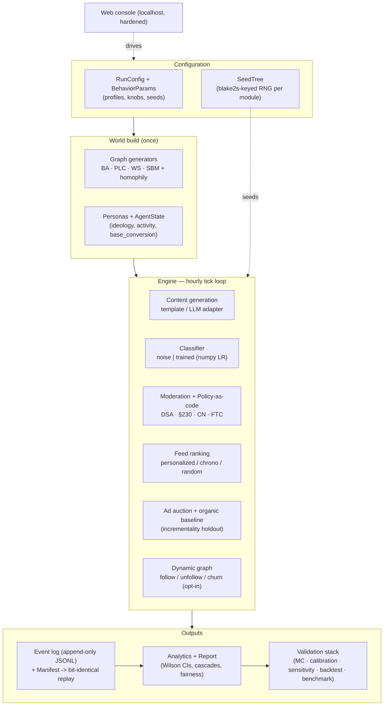
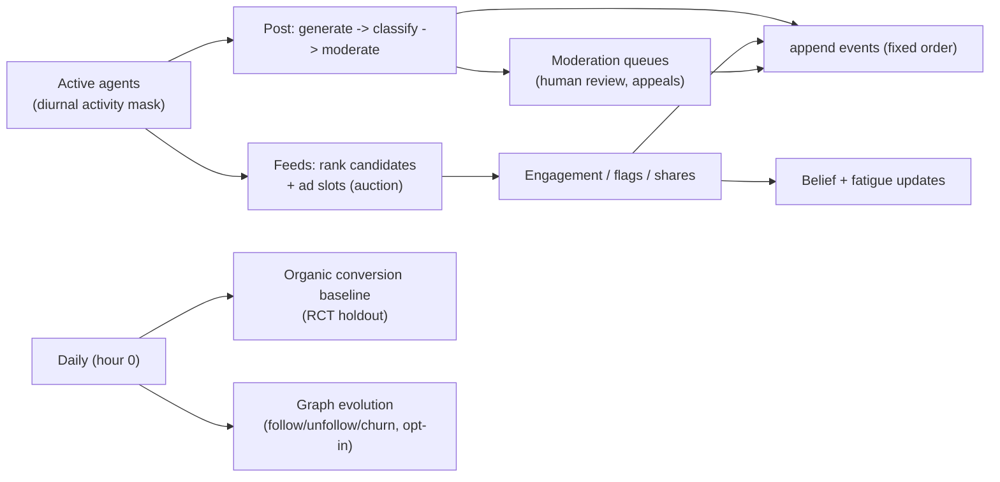
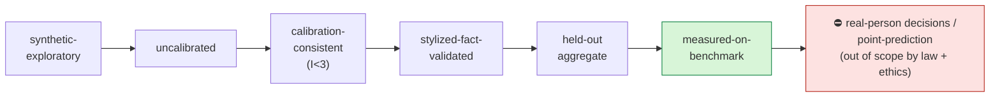

# SocioSim — Models & Architecture

A professional reference to **what SocioSim models, how the pieces fit, and how
strongly each output is validated**. SocioSim is a deterministic, reproducible,
uncertainty-quantified, policy-as-code social-interaction simulator (research
use only). Every output carries a **provenance label** that bounds the claim it
licenses (see the validation ladder below).

---

## 1. System architecture

## 2. Per-tick data flow

Determinism: every random draw comes from a module-keyed `SeedTree` generator and
events append in a fixed order, so a run replays to a **bit-identical SHA-256
event-stream hash** from its manifest (`logs/replay.py`, locked by
`tests/test_determinism_regression.py`).

---

## 3. The models

| Subsystem | Module | What it models | Method / notes |
|---|---|---|---|
| **Agents** | `agents/personas.py`, `agents/state.py` | synthetic users: ideology, topic interests, diurnal activity, latent `base_conversion`, trusted-flagger flag | sampled from documented distributions on a seeded RNG |
| **Social graph** | `graph/generators.py` | network structure | BA (scale-free), **PLC** (Holme–Kim: scale-free **+** tunable clustering), WS (small-world), SBM (communities) + homophily rewiring; approx clustering for n>5000 |
| **Dynamic graph** | `engine.py` | follow / unfollow (triadic closure) / churn | opt-in daily evolution, emitted as events, deterministic + replayable |
| **Content** | `content/generate.py`, `claude_adapter`, `llm_adapter` | posts: topic, stance, media type, AI-label, true categories | deterministic templates (default) or cached local/Anthropic LLM; optional category-signal tokens for the trained classifier |
| **Moderation classifier** | `content/classify.py`, `content/ml_classifier.py` | platform belief about content categories | `noise` = calibrated noise model; `trained` = real numpy one-vs-rest logistic regression (measured P/R); **measured on real benchmarks** via `validation/benchmark_eval.py` |
| **Moderation + policy** | `moderation/workflow.py`, `policy/engine.py` + `packs/*.yaml` | notice-and-action, human review, appeals, jurisdiction obligations | policy-as-code with statute citations (DSA, §230, CN labelling, FTC); transparency tally |
| **Feed** | `feed/ranking.py` | ranking + exposure | personalized / chronological / random; ε-exploration; ad-slot interleaving |
| **Ads + incrementality** | `ads/auction.py`, `ads/campaigns.py`, `ads/measure.py` | auctions, organic baseline, lift | RCT holdout, Newcombe diff-CI, CUPED, two-proportion p, BH-FDR, ROAS/iROAS/CAC/LTV, dose-response, MDE |
| **Media synthesis** | `content/media.py` | real image/video bytes | deterministic procedural PNG + APNG (zero-dep); pluggable diffusion backend |
| **Compute** | `validation/montecarlo.py`, `accel.py` | scale | pluggable executor (ProcessPool / Dask / Ray); CuPy-or-NumPy kernel |

---

## 4. Quant & validation stack

| Layer | Module | Output | Provenance |
|---|---|---|---|
| Determinism / replay | `rng.py`, `logs/` | bit-identical SHA-256 | locked baseline |
| Monte Carlo | `validation/montecarlo.py` | percentile intervals | `mc-replicated` |
| Calibration | `validation/calibrate.py`, `targets.py` | implausibility I vs published aggregates | `calibration-consistent` |
| Sensitivity | `validation/sensitivity.py`, `study.py` | first-order + **Saltelli total-effect ST** (multi-output, Sobol, multi-seed) | — |
| ABC → output | `validation/study.py` | parameter-uncertainty interval | `abc-posterior-propagated` |
| Stylized facts | `validation/stylized.py` | reproduces documented regularities | `stylized-fact-validated` |
| Held-out aggregate backtest | `validation/backtest.py` | held-out aggregates within tolerance | `held-out-aggregate` |
| Measured benchmark | `validation/benchmark_eval.py` | real F1 / ROC-AUC on licensed data | `measured-on-benchmark` |

### Validation ladder (how "measured" a claim is)

**No claim may exceed its label.** The simulator's *agent-behaviour magnitudes*
sit at `calibration-consistent` / `stylized-fact-validated`; the *moderation
classifier component* reaches `measured-on-benchmark`. Decisions about real
individuals and point-prediction of a specific platform are **out of scope** by
design (GDPR Art. 22 / EU AI Act / project ethics).

---

## 5. Measured classifier results (real, licensed data)

`python run.py --measure-classifier` → `BENCHMARK_REPORT.md` (deterministic):

| Benchmark | Task | License | F1 | ROC-AUC |
|---|---|---|---|---|
| Civil Comments | toxicity | CC0-1.0 | ~0.72 | ~0.78 |
| Deysi spam-detection | spam | Apache-2.0 | ~0.98 | ~1.00 |

A transparent numpy logistic-regression over hashed features — auditable and
deterministic, trading peak accuracy for reproducibility + explainability. Data
is PII-scrubbed and governed in `docs/DATA_MANIFEST.md`.

---

## 6. Settings audit (data-driven) & the two lenses

Configurable knobs are audited using **multi-output Saltelli total-effect
sensitivity** (behaviour params) and a **one-at-a-time effect-size screen**
(config knobs). Findings are evidence-weighted rather than absolute:

- **No currently exposed knob is intentionally decorative.** Each knob is wired
  to a model mechanism or local calculator, but some effects are lens-specific,
  sample-size-dependent, or visible only in certain regimes. The UI now marks
  local planning calculators separately from simulation settings.
- **Knobs are lens-specific** — which is why the UI/report now tag them:
  - *Government / Regulatory lens*: jurisdiction packs, classifier operating
    point, human review, appeals, EU opt-out → drive the **compliance/safety**
    output (harmful-exposure, moderation P/R, appeals, transparency).
  - *Marketing lens*: ads, holdout, frequency cap, ad-slot interval, campaigns →
    drive the **incrementality/ROI** output (iROAS, ROAS, CAC). These show ~0
    effect on *organic* metrics precisely because they act on the ad surface —
    not uselessness, but lens-specificity.
  - *Core*: graph, homophily, feed mechanics, scale — shared substrate.
- **Influence varies by report/sample:** `impression_fatigue` is treated as an
  advanced behaviour knob. Prior small sensitivity reports were not stable enough
  to justify absolute "low-influence everywhere" wording; use the latest
  sensitivity run and estimator uncertainty before ranking calibration priority.
- **No deletions/merges** were warranted; **candidate future additions** (only if
  a use-case demands and they prove statistically significant): an explicit
  proactive-detection-rate knob and a trusted-flagger-priority toggle (DSA Art.
  22) — currently implicit in the classifier/behaviour params.

The active lens(es) and a plain-language reading of the ending output are printed
in every run report ("Run lens & output interpretation") and the web run banner.

## 7. Guardrails & governance

- **Determinism**: same config + seed → identical event-stream hash (never regress).
- **Data**: aggregate/public/de-identified only; no PII; no scraping; DSA Art. 40
  gate for any real microdata (`docs/DATA_MANIFEST.md`).
- **Security**: localhost console hardened — access token, Origin/Host check, CSP +
  security headers, body/Content-Type limits, SSRF allow-list (`SECURITY.md`).
- **Ethics**: synthetic agents; outputs are counterfactual projections, not
  predictions; not for targeting/ranking real individuals or enforcement.

See `README.md` (quick start), `docs/usage.md` (configuration + ladder),
`docs/RESEARCH_EVIDENCE.md` (cited evidence base), and the `*_REPORT.md` artifacts
(`VALIDATION` / `CALIBRATION` / `BACKTEST` / `BENCHMARK`).
